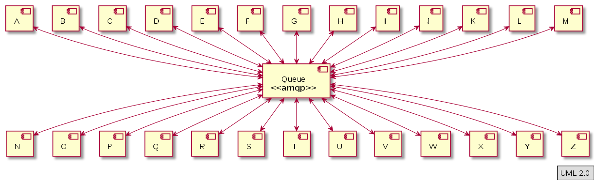
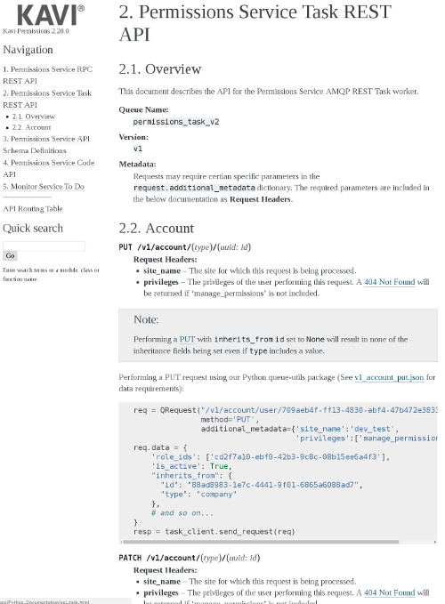
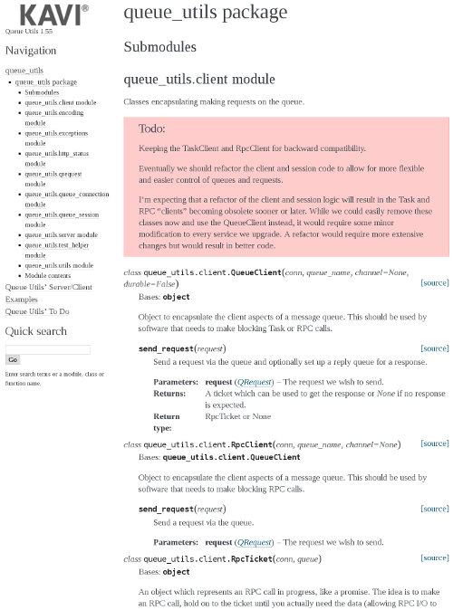
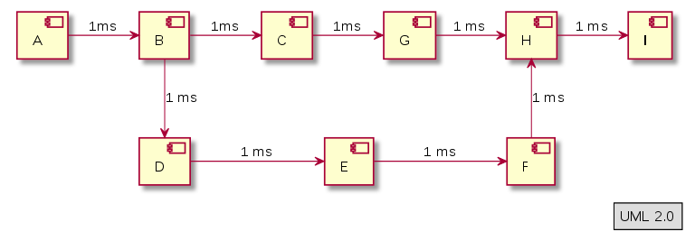
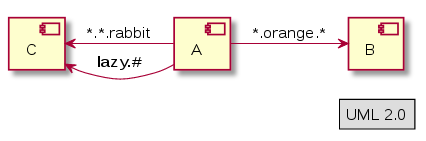
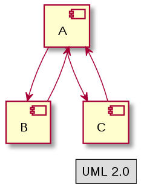
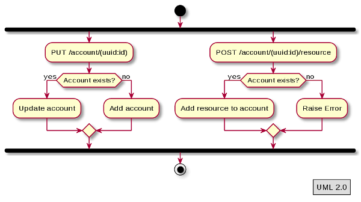
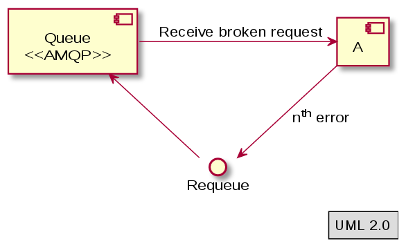
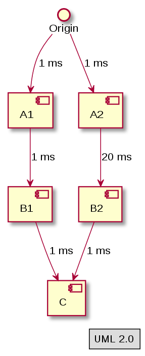
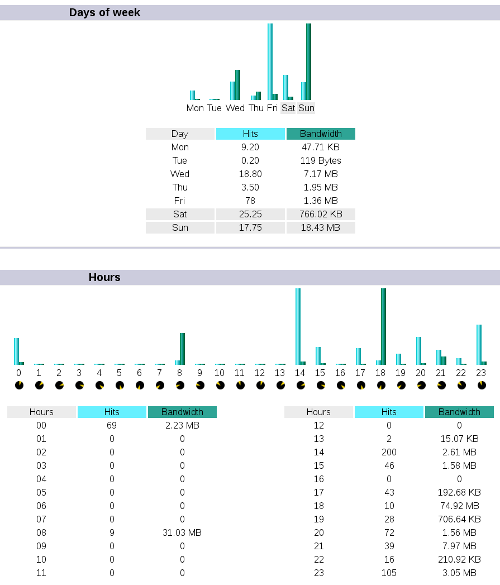

class: center, middle
# Micro-services provide some benefits, but at what cost?
## Serge Domkowski <sdomkowski@kavi.com>
.footnote-center[Presentation created using remarkjs http://remarkjs.com/]
---
## Who am I?

__Serge Domkowski__ .red[*]
_Software Architect_

I’ve been involved in making web software for about 22 years. I design and
write code, talk about code, play with my son, ride my bicycle, root for the
Timbers, drink beer, and once in a while sleep.

__Kavi Corporation__ .red[**]


_Our mission is to help results-driven teams share and organize complex work._

- 22 Employees
- 8 Engineers

.footnote[
  .red[*] <sdomkowski@kavi.com>

  .red[**] http://www.kavi.com
]
???
* Relax
* Eye contact
* Engage
---
class: center, middle
# Why am I here?
## To discuss some hard choices concerning micro-services.
???
Several years ago I went to a talk on micro-services here at OS-Bridge. [_Personal Story_]
* We were doing the same things they were
* Only talked about what was going right

__There are some hurdles to micro-services which should be shared.__
---
class: center, middle
# Why Micro-services?
## Specifically, What Were Our Objectives?
---
## Scalability

Customer size and resource utilization vary drastically. Customer bandwidth
requirements tend to be low to moderate with spikes during the calendar year.
Some application features/components are utilized far more than others.

.center[]
???
* Every customer is different.
* They represent different sectors of the business world.
* Their needs are different.

[_Last sentence_] __Some application features/components are utilized far more than others.__
---
## Scalability

Customer size and resource utilization vary drastically. Customer bandwidth
requirements tend to be low to moderate with spikes during the calendar year.
.red[__Some application features/components are utilized far more than others.__]

.center[
## Micro-services would allow us to scale<br>specific business components independent<br>of other business components.
]
---
## Flexibility

Customer requirements are evolving as new technologies arise. This results in
the need to be able to integrate these new technologies into or with our
application and the need for our existing functionality being adaptable to
the future needs of our customers.

.center[]

???
* Customer needs evolve over time.
* New technologies present integration opportunities.
* Functionality needs to be adaptable.

__Interestingly, businesses expect applications to support their business needs.__
---
## Flexibility

Customer requirements are evolving as new technologies arise. This results in
the need to be able to integrate these new technologies into or with our
application and the need for our existing functionality being adaptable to
the future needs of our customers.

.center[
## Interfaces represent business logic which tend<br>to be easy to adapt to external services.
]
???
Micro-services are all about business needs. [_Continuation on prevous point_] 
---
## Maintainability

Advances in technology, new security concerns, and evolving customer needs
require rapid development. We expect that 50-80% of the code today will be
obsolete in 5 years. The application must be able to handle changes without
degrading quality.

```php
//
//     set_local_conf($directory, $variable, $value)
//        Place the $variable/$value pair in the $local_conf file that
//        exist in the $directory. If the $$local_conf file does not exist
//        then create one.  
//
function set_local_conf($directory, $variable, $value) 
{
  $local_conf = '.htconf';

  $file =  $directory . "/" . $local_conf;

  // Open the file, it will be created if it doesn't exist
  if ( !file_exists( $directory . "/" . $local_conf )) {
    $fp = fopen ( $file, "a+" );
  }
  else {
    $fp = fopen ( $file, "r+" );
  }
  
  // Now walk throught the file and try to find an entry 
  // in the file
  $added_line=FALSE;
  $index=1;
  $file_lines = array();
  rewind($fp);  
  while ($line = fgets( $fp, 255)) {
    // lets ignore the php start end php end marks for now
    if ( !strstr ($line, '?>') &&
     !strstr ($line, '<?') ) {
      if (strstr ($line, $variable)) {
    $file_lines[$index]= $variable . " = '" . $value  . "';\n";
    $added_line = TRUE;
      }
      else {
    $file_lines[$index]=$line;
      }
    }
    $index++;
  }

  // If the value didn't already exist then lets add it at the end
  if ( !$added_line ) {
    $file_lines[$index]= $variable . " = '" . $value  . "';\n";
    $index++;
  } 

  // Add beginning marks
  $file_lines[0]= '<?' . "\n";

  // Now lets rewrite the file
  rewind($fp);
  for ($i=0 ; $i<=$index; $i++) {
      if (isset ($file_lines[$i])) {
          $newline = $file_lines[$i];
          fwrite ($fp, $newline);
      }
  }
  fclose ($fp);
  chmod ($file, 0664);
}
```
???
* We expect 50-80% of the code today will be obsolete in 5 years.

__Code ages and needs to be upgraded or replaced.__
---
## Maintainability

Advances in technology, new security concerns, and evolving customer needs
require rapid development. We expect that 50-80% of the code today will be
obsolete in 5 years. The application must be able to handle changes without
degrading quality.

.center[
## Micro-services can be replaced at will!
]
???
__(Point at slide and read)__
---
class: center, middle
# What could possibly go wrong?
## And how do we deal with it?
???
* Now the meat of the presentation!
* Relax
* Eye contact
* Engage
---
class: center, middle
# #1.
## Misjudged the complexity.
???
* While a micro-service may be simple compared to a 1 million line monolith.
* A collection of micro-services is a whole new kind of complex.
* [_Reality check_] Complexity is the essance of coding; You cannot have code without it.
---
## Interfaces, Interfaces, Interfaces.

.center[]
???
* Micro-services have interfaces.
* With a lot of services, come a lot of interfaces.
---
## Interfaces, Interfaces, Interfaces.


* __Documentation__
  * Automated Code Documentation
  * Automated API Documentation
  * Architectural Documentation

.center[


]
???
* Document the code and automate documentation; This is just common sense.
* API documentation is a must; There is a horrible lack of tools for automating.
* Architecture: Pay special attention to inter-service dependencies.
---
## Interfaces, Interfaces, Interfaces.

* __The Tangled Web__
  * Limited Depth
  * Established Usage Patterns
  * Topic Exchange

.center[
<br>

]
???
* Deeply connected inter-service communication leads to problems.
* Most of the rest of this presentation deals with these problems.
* Establish patterns and stick to them.
* AMQP Topic Exchange.
---
## Asyncronous Communication

.center[]
???
* Web used to be about one page at a time.
* Not anymore (Frondend frameworks; SOA)
---
## Asyncronous Communication

* __Order of Operations__
  * Requeuing

.center[]
???
* Order matters; The context of a request may depend on another request.
* Tail end requeuing to fix ordering issues.
---
## Asyncronous Communication

* __Failures / Timeouts__
  * Dead Letter Queue
  * Monitoring
  * Tracebacks

.center[]
???
* To further complicate the issue of requeuing...
* Some failures don't go away.
* Don't requeue forever.
* Make sure you know when things go wrong.
* Make sure you can figure out what went wrong.
---
## Asyncronous Communication



* __Latency__
  * Forced Lag
  * Re-checking
  * Obscurity
  * Notification
???
* Time can work against you.
* Hops/time vs. Expectation.
* Dealing with it.
---
## Asyncronous Communication

<div style="float:right">
.center[]

</div>

* __Debugging__
  * Configurable Logging
  * Log Analytics
  * QA Cluster
???
* You can't fix what you can't find.
* Async issues can be near impossible to replicate.
* Get all the data you can.
---
## Inter-service Dependencies

.center[<image src="./images/dependency.png" style="width:660px;padding-top:80px">]
???
* Interfaces lead to dependencies which lead...
* A whole lot of problems.
---
## Inter-service Dependencies

* __Planning__
  * Establish Usage Patterns
  * Determine Suitable Services
  * Architectural vs. UX Documentation

.center[<image src="./images/messaging.png" style="width:500px;padding-top:60px">]
???
* Know your dependencies.
* Define your dependencies.
* Minimize your dependencies.
---
## Inter-service Dependencies

* __Deployment__
  * API Versioning
  * Pre-deployment of Dependencies

.center[<image src="./images/versioning.png" style="width:360px;padding-top:60px">]
---
## Inter-service Dependencies

* __Duplication__
  * Code Libraries
  * Replication of Data
???
* Standardized interfaces may lead to duplication of code across multiple languages.
* Keys and other data duplicated across databases.
---
class: center, middle
# #2.
## Forgot to ask the customer what they needed.
???
* [_Read it!_]
* Micro-services solve some problems.
* But present some as well.
* Your customer needs may be met better with a different arch.
* There is no Siver Bullet.
---
## Process Control

* __Service level Configurability__
  * Stored Service Configuration/Customer
* __User level Configurability__
  * Stored Client-Side Configuration/Session
???
* Customers need to manage process.
* Different users have different expectations.
* Customer per/service configurability.
  * Potential duplicate configurations.
  * Some interesting UX considerations.
* User configurability.
  * This one is a bit easier.
---
## Activity Reporting

* __Data Replication__
  * Duplication of Data
  * Aggregation of Data

.center[]
???
* Marketing/Sales/Billing
  * Solr
TODO
---
class: center, middle
# How has this changed what we do?
---
## Product/UX/Architecture Three Month Plan
???
* Have to get ahead of it.
* Find dependency issues early and figure out how to deal with them.
---
## Product/UX/Architecture Three Month Plan

## REST can not solve everything
???
* Not everything fits "REST".
* Use it's concept of utilizing the protocol.
* Don't force evey protocol to be HTTP.
---
## Product/UX/Architecture Three Month Plan

## REST can not solve everything

## Duplication is not evil
???
* 1) Disk space is cheap/Processing is expensive.
* 2) If you standardize your architecture, your services will duplicate.
* 3) I have the same line copied on 4 of these slides.
---
## Product/UX/Architecture Three Month Plan

## REST can not solve everything

## Duplication is not evil

## Error handling is critical
???
* You have to deal with errors.
* You have to deal with them well.
---
class: center, middle
# Questions?
---
## Further Reading

__AMQP 0.9.1 - Advanced Message Queuing Protocol__
http://www.amqp.org/specification/0-9-1/amqp-org-download

__Microservices - a definition of this new architectural term__
http://martinfowler.com/articles/microservices.html

__Service Oriented Architecture__
http://www.opengroup.org/soa/source-book/soa/soa.htm

__No Silver Bullet - Essance and Accident in Software Engineering__
http://worrydream.com/refs/Brooks-NoSilverBullet.pdf

__Dependency Oriented Thinking - Volume 1__
https://www.infoq.com/minibooks/dependency-oriented-thinking-1

__Dependency Oriented Thinking - Volume 2__
https://www.infoq.com/minibooks/dependency-oriented-thinking-2

__Flow Based Programming__
http://www.jpaulmorrison.com/fbp/

