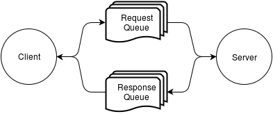

class: center, middle
# RESTful Micro-service communication over AMQP
## Serge Domkowski <sdomkowski@kavi.com>
.footnote-center[Presentation created using remarkjs http://remarkjs.com/]
---
.left-column[
  ## Who am I?
]
.right-column[
**Serge Domkowski.red[*]**  
*Senior Web Application Engineer*

I’ve been involved in making web software for about 20 years. I write code,
play with my son, ride my bicycle, root for the Timbers, drink beer, and
once in a while sleep.

.footnote[.red[*] <sdomkowski@kavi.com>]
]
---
.left-column[
  ## Where do I work?
]
.right-column[
**Kavi Corporation.red[*]**   
*"Better Collaboration. Faster Consensus."*

Kavi Corporation is the leading provider of **structured collaboration** and
consensus solutions for purpose-driven organizations. Over the
**past 15 years** we have grown our knowledge about how committee-driven
organizations operate, how to support their **unique requirements**, and what
they need to successfully collaborate.

- 23 Employees

- 10 Engineers

.footnote[.red[*] http://www.kavi.com]
]
---
class: center, middle
# Why?
---
.left-column[
  ## Why?
  ### - Legacy
]
.right-column[
## Entropy

15 years of adding to monolithic applications has led to 500,000
lines of highly layered, poorly documented code with none of the
original developers around to help.

## Customization

Organizations have been structuring collaboration among their participants
since well before there was software to fill that need.

The result is 100s of organizations all with different ideas on how this
should be done.
]
---
.left-column[
  ## Why?
  ### - Legacy
  ### - Future
]
.right-column[
## Integration

15 years ago, the number of products available for managing business needs
was close to nil. Now that is not the case.

We can't compete with every other product so as to provide the full breadth
of business needs. However, we can compete better with products in our
sector by integrating better with the other products a business is using.

## Performance

Complexity in the business logic leads to slower transactions. Ideally you
would want to reduce the complexity. This is not always possible. However, the
perception of speed for the end user need not suffer.
]
---
class: center, middle
# How?
---
.left-column[
  ## How?
  ### - SOA
]
.right-column[
## Service-Oriented Architecture.red[*] (SOA)

A loosely coupled collection of services which communicate with each other by
passing data via well defined interfaces.

### Benefits

- Reusable

- Replaceable

- Replicable

.footnote[.red[*] http://www.opengroup.org/soa/source-book/soa/soa.htm]
]
---
.left-column[
  ## How?
  ### - SOA
]
.right-column[
### The Problem with SOA

.footnote[Diagrams generated using draw.io https://www.draw.io/]
]
---
.left-column[
  ## How?
  ### - SOA
  ### - REST
]
.right-column[
## Representational State Transfer.red[*] (REST)

.quote["The Representational State Transfer (REST) style is an
abstraction of the architectural elements within a distributed
hypermedia system".red[*]]

### Benefits

- Defined

- Simple

.footnote[.red[*] http://www.ics.uci.edu/~fielding/pubs/dissertation/rest_arch_style.htm]
]
---
.left-column[
  ## How?
  ### - SOA
  ### - REST
  ### - AMQP
]
.right-column[
## Advanced Message Queuing Protocol.red[*] (AMQP 0.9.1)

.quote["AMQP is an open Internet (or “wire”) Protocol standard for
message-queuing communications.".red[*]]

### Benefits

- Stable

- Scalable

- Concurrent

.footnote[.red[*] http://www.amqp.org/specification/0-9-1/amqp-org-download]
]
---
.left-column[
  ## How?
  ### - SOA
  ### - REST
  ### - AMQP
]
.right-column[
## AMQP and SOA

### RPC Request/Response Cycle

### Task Request Cycle

]
---
.left-column[
  ## How?
  ### - SOA
  ### - REST
  ### - AMQP
]
.right-column[
## AMQP and REST

AMQP messages are composed of attributes and a payload.

* The attributes resemble HTTP headers.
* The payload is equivalent to HTTP content.

### Attributes -> Headers
<table class="table">
<tr>
<th>AMQP</th><th>HTTP</th>
</tr>
<tr>
<td>Content type</td><td>Content-Type</td>
</tr>
<tr>
<td>Content encoding</td><td>Content-Encoding</td>
</tr>
<tr>
<td>Optional header</td><td>X-*</td>
</table>
]
---
.left-column[
  ## How?
  ### - SOA
  ### - REST
  ### - AMQP
]
.right-column[
## AMQP Protocol Commands

- **Connection**  
  *A long lasting connection to the AMQP server which can carry
  multiple channels.*

- **Channel**  
  *A way to multiplex the connection. Channels are independent of
  one another and concurrent.*

- **Exchange**  
  *A means to defining the wiring. In most cases, not heavily utilized.*

- **Queue**  
  *The foundation for any service wanting to consume messages.*

- **Transaction**  
  *Messages buffered to the service and only committed on demand by the client.*
]
---
.left-column[
  ## How?
  ### - SOA
  ### - REST
  ### - AMQP
]
.right-column[
## AMQP Connection

**Creating a connection requires:**

1. Open a socket.
2. Send "Start" and receive "Start-Ok".
3. Send "Secure" and receive "Secure-Ok" (optional?).
4. Send "Open" and receive "Open-Ok".

Most libraries will handle all of this for you. However, it's a fair
amount of overhead to perform on every request. To reduce this overhead,
reuse the same connection for multiple requests.

.red[**Warning!** Your AMQP server is likely to retire a connection that
has had no activity for an extended period of time. Utilize a heartbeat to
prevent this on long lasting connections. Not all client code allows for a
heartbeat.]
]
---
.left-column[
  ## How?
  ### - SOA
  ### - REST
  ### - AMQP
]
.right-column[
## AMQP Channel

We are using a channel per request. **Not** per queue, but per request.

So in the RPC example there is a single channel even though two queues
are utilized.

**Note:** While researching this topic, it occurred to me that we could
*probably* use the same channel for multiple requests.
]
---
.left-column[
  ## How?
  ### - SOA
  ### - REST
  ### - AMQP
]
.right-column[
## AMQP Exchange

We are using the default exchange with no modifications what-so-ever
and have found AMQP more than flexible enough as is.
]
---
.left-column[
  ## How?
  ### - SOA
  ### - REST
  ### - AMQP
]
.right-column[
## AMQP Queue

The queue is the basic unit by which AMQP handles messages.

There are two classes of queue: "durable" which is persistent
and "temporary" which is not.

In our "Task Request Cycle" example we use a "durable" queue to
ensure that everything placed on the queue will eventually get
delivered to the consuming service.

In our "RPC Request/Response Cycle" example we use the "temporary"
queue as we don't need or want it to persist.

**Note:** A queue is one way from the publisher to the consumer.
In order for the consumer to respond to the publisher, another
queue must exist where the publisher is the consumer. The RPC
example shows exactly this.
]
---
.left-column[
  ## How?
  ### - SOA
  ### - REST
  ### - AMQP
]
.right-column[
## AMQP Transaction

The AMQP transaction is similar to a database transaction.

You know prior to commiting the transaction thati the messages have been
delivered to the AMQP server, but they can not be consumed until the
transaction is committed.

Transactions are useful when you have multiple remote tasks that you
want to take place *only if* a local task is successful (e.g., a database
update).
]
---
class: center, middle
# Difficulties
---
.left-column[
  ## Difficulties
  ### - Planning
]
.right-column[
## Considerations when Planning

* **In which service(s) to implement.**  

  *Where the feature(s) are implemented profoundly  
  affects everything listed below.*

* **Prevent breaking the API or plan for it.**  

  *Add to the API if possible. If you must change,
  plan for it in your release process.*

* **Code replication across services.**  

  *Services communicating the same way over the same
  infrastructure will reuse code.*

* **How/when to release.**  

  *In SOA, parts of feature code can be released early.*

* **Scaling.**  

  *An under burdened service is fine. Overburdened is bad.*
]
---
.left-column[
  ## Difficulties
  ### - Planning
  ### - Debugging
]
.right-column[
## Debugging and Testing

* APIs are easy to test.

* Integration is NOT.  

  * Add to this that you are integrating over AMQP.  

  * Add to this that most of your integration is one way.  

## How to help yourself

* Log prolifically (Ideally to a single point).

* Find AMQP management tools.

* Unit test thoroughly.

* Document your APIs.
]
---
.left-column[
  ## Difficulties
  ### - Planning
  ### - Debugging
  ### - Deployment
]
.right-column[
## How to deploy

.quote[
  You are about to deploy a new feature to your production environment.
  Seven services which live on four different systems will need to be
  updated as will their underlying databases.
]

* Determine what your dependencies are.

* Perform database migrations.

* Automate configuration changes.

* Automate code deployment.

* Automate and automate some more.
]
---
.left-column[
  ## Further Reading
]
.right-column[
### Flow-based Programming

http://www.jpaulmorrison.com/fbp/examples.html

### Scaling to 100+ APIs

http://www.oscon.com/oscon2012/public/schedule/detail/23281

### High Availability

http://highscalability.com
]
---
class: center, middle
# Questions?

